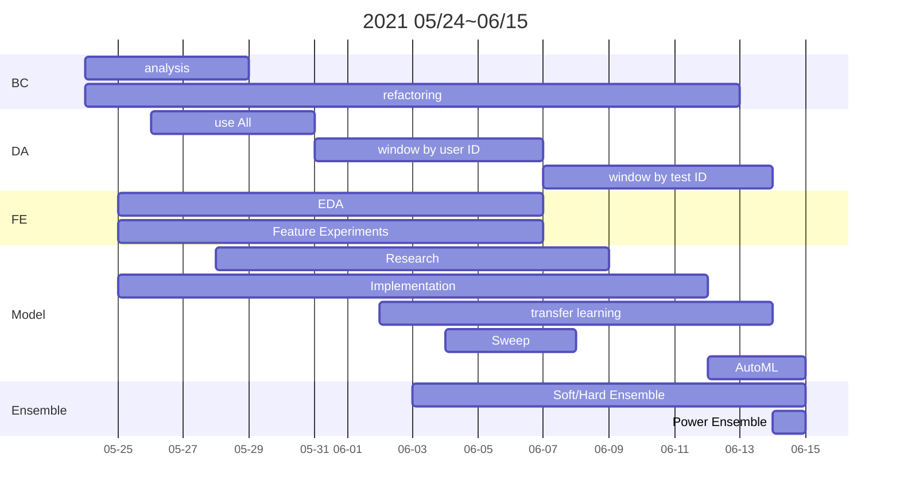

[DKT 1조] Generalization w/ Multiple Models 

## Table of Contents
[TOC]


Leaderboard Score
---
- 해당 대회는 Test dataset을 50:50으로 나눠 각각 Public, Private leaderboard score (AUROC) 를 계산했습니다.
    - Public Score : 4th, 83.55%
    - Private Score : 2nd, 84.64%


Overview
---
- Background: 초등학교, 중학교, 고등학교, 대학교와 같은 교육기관에서 우리는 시험을 늘 봐왔습니다. 시험 성적이 높은 과목은 우리가 잘 아는 것을 나타내고 시험 성적이 낮은 과목은 반대로 공부가 더욱 필요함을 나타냅니다. 시험은 우리가 얼마만큼 아는지 평가하는 한 방법입니다.


- Why DKT?: 하지만 시험에는 한계가 있습니다. 우리가 수학 시험에서 점수를 80점 받았다면 우리는 80점을 받은 학생일 뿐입니다. 우리가 돈을 들여 과외를 받지 않는 이상 우리는 우리 개개인에 맞춤화된 피드백을 받기가 어렵고 따라서 무엇을 해야 성적을 올릴 수 있을지 판단하기 어렵습니다. 이럴 때 사용할 수 있는 것이 DKT (Deep Knowledge Tracing) 입니다!


- Goal: 주어진 학생들의 문제 풀이 이력을 기반으로, 풀지 않은 새로운 문제가 특정 학생에게 주어질 때 정답을 맞출 수 있을지 없을 지를 추론할 수 있는 binary classifier 모델을 만듭니다.


Team Members
---
| 백서윤 | 이수연  | 이준호 | 이태환 | 진소정 | 주찬형 |
| ----- | ---- | ---- | ---- | ---- | ---- |
| | | | | | |

- DKT 1조 [*드크트즐흐그슾드*]
- 총 6명

Our Works
---

- 우리 팀은 성능 개선을 위한 윈도우 슬라이딩 기반 data augmentation, 정확한 예측을 도울 수 있는 feature engineering을 통한 학습 파이프라인을 구축했습니다.
- Sequence data, DKT task에 적합하다고 판단되는 여러 모델들을 research, 구현하여 학습했고 앙상블을 통해 shake-up을 예방하면서 score를 올리려 노력했습니다.
- Problem Statement & Methods : **우리 팀의 문제 해결 과정은 다음 [링크](https://github.com/bcaitech1/p4-dkt-DKTJHGSD/wiki/Wrapup-report)를 통해 자세히 확인하실 수 있습니다.**


Code Structure
---
```
.
├── README.md
└── code
    ├── Riiid_transform.ipynb
    ├── args.py
    ├── dkt
    │   ├── criterion.py
    │   ├── dataloader.py
    │   ├── engine.py
    │   ├── metric.py
    │   ├── model.py
    │   ├── optimizer.py
    │   ├── scheduler.py
    │   ├── trainer.py
    │   └── utils.py
    ├── lgbm_baseline.ipynb
    ├── requirements.txt
    └── train.py
```

Dependencies
---
```
code/requirements.txt

torch
pandas
sklearn
tqdm
wandb
transformers
easydict
```

Implemented model
---


| MODEL | AUC  |
| ----- | ---- |
| LSTM  | 82.08|
| LSTM attention | 82.83|
| LGBM  |82.66|
| SAINT |  81.55|
| Lastquery |82.24|
| LSTM-SAKT  |80.93|
| LANA  |81.64|
| LastNquery |80.64|
| Pretrained Lastquery|81.66|


How to run
---

#### install required packages
```
$ cd code
$ pip install -r requirements.txt
```


#### train
```
$ python ./train.py --model [MODEL_NAME] [...params...]


--- List of params --- 
model : name of model
save_name : name of saving model
n_epochs : number of epochs
lr : learning rate
by_window_or_by_testid : choose split data mothod
Tfixup : whether to apply T-fixup or not
.
.
.

you can find more params in code/dkt/args.py 😃
```
#### inference
```
$ python ./train.py --model [MODEL_NAME] [...params...] --mode inference

### you have to use same params with train! ###
```


Project Timeline
---

> BC: Baseline Code, DA: Data Augmentation, FE: Feature Engineering


- [project](https://github.com/bcaitech1/p4-dkt-DKTJHGSD/projects)탭에서 세부적인 task들을 확인할 수 있습니다.

Reference
---
*Youngduck Choi et al., Towards an
Appropriate Query, Key, and Value Computation for Knowledge Tracing. 2020.*

@misc{Charles2013,
  author = {Charles, P.W.D.},
  title = {Project Title},
  year = {2013},
  publisher = {GitHub},
  journal = {GitHub repository},
  howpublished = {\url{https://github.com/charlespwd/project-title}},
  commit = {4f57d6a0e4c030202a07a60bc1bb1ed1544bf679}
}
*update 예정*


###### tags: `DKT` `Boostcamp` `드크트즐흐크슾드` `2nd solution`